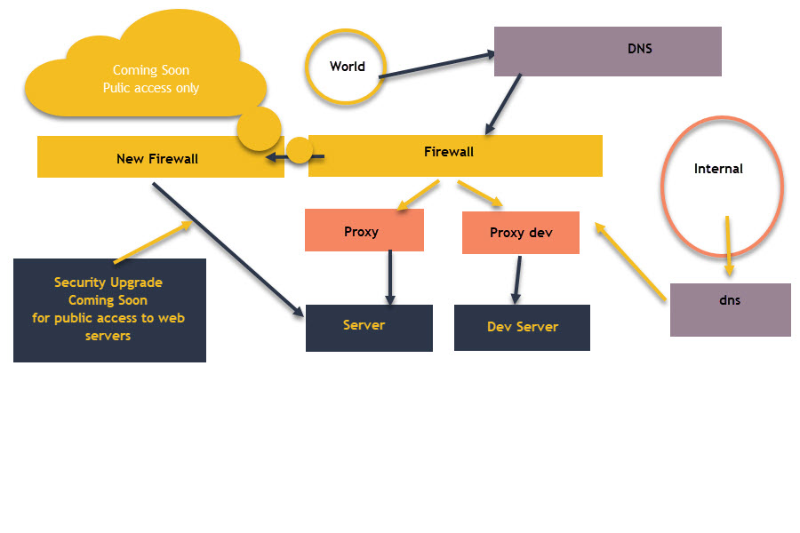

## ACI Portal - FastAPI Framework

How to run application from root directory in Development
- uvicorn app.main:app --host 127.0.0.1 --port 8000
- uvicorn app.main:app --host 0.0.0.0 --port 5000

How to run application from root directory in Production
- uvicorn app.main:app --host 0.0.0.0 --port 8081 --ssl-keyfile /etc/pki/nginx/private/server.key --ssl-certfile /etc/pki/nginx/server.crt


### Pipenv Environment Managed
- [Pipenv Docs](https://pipenv.pypa.io/en/latest/)

### Packages and Dependency built-ins
Refer to Pipfile for dependency graph (optional: remove unwanted deployment resources)
```shell
# From aci-portal directory run following commands
# Show contents of Pipfile
cat Pipfile
# List full requirements
pipenv requirements
# Show graphed dependencies
pipenv graph

# Example output from graph
httptools==0.6.1
python-dotenv==1.0.1
PyYAML==6.0.1
requests==2.31.0
├── certifi [required: >=2017.4.17, installed: 2024.2.2]
├── charset-normalizer [required: >=2,<4, installed: 3.3.2]
├── idna [required: >=2.5,<4, installed: 3.7]
└── urllib3 [required: >=1.21.1,<3, installed: 2.2.1]
uvloop==0.19.0
watchfiles==0.21.0
└── anyio [required: >=3.0.0, installed: 4.3.0]
    ├── exceptiongroup [required: >=1.0.2, installed: 1.2.1]
    ├── idna [required: >=2.8, installed: 3.7]
    ├── sniffio [required: >=1.1, installed: 1.3.1]
    └── typing-extensions [required: >=4.1, installed: 4.11.0]
websockets==12.0

```
- FastAPI
- Bootstrap 5
- Font Awesome
- Jinja2
- Docker
- Podman
- Env Files
- Kubernetes
- Aws
- Azure
- Heroku
- Vercel

### Hosted Endpoints
- https://vercel.com/tjaskot/aci-portal
- https://aci-portal-tjaskot.vercel.app/index

### Architecture Digrams

- 
- 
- 

### Directory Structure

- **app** - to contain python code and FastAPI framework
- **kustomize** - for kubernetes resources and deployment files
- **resources** - word documents and any references to be used for documentation purposes and user assistance
- **Containerfile** - podman container builds
- **Dockerfile** - container build image file for Docker
- **Pipfile** - python pipenv file for server ecosystem
- **Pipfile.lock** - python pipenv lock file for packages, dependencies, and versions
- **Procfile** - open source cloud foundry deployments on Heroku
- **requirements.txt** - if Pipenv is not supported on local machine, 
use "pipenv freeze > requirments.txt" and leverage accordingly
- **vercel.json** - python deployment file for vercel cloud applications

### Nginx Setup and Configuration

- [Nginx RHEL Docs](https://docs.redhat.com/en/documentation/red_hat_enterprise_linux/8/html/deploying_different_types_of_servers/setting-up-and-configuring-nginx_deploying-different-types-of-servers#configuring-nginx-as-a-web-server-that-provides-different-content-for-different-domains_setting-up-and-configuring-nginx)

```shell
# Install Nginx
dnf install nginx

dnf module list nginx

# Current version is 1.24
dnf module enable nginx:stream_version

firewall-cmd --permanent --add-port={80/tcp,443/tcp}
firewall-cmd --reload

systemctl enable nginx
systemctl start nginx

# Verification Steps
dnf list installed nginx
firewall-cmd --list-ports
# Should return: enabled
systemctl is-enabled nginx
# If not enabled, run:
systemctl enable nginx
systemctl restart nginx
systemctl status nginx
```

### Systemctl Integration

#### SOP steps - Overview
Get systemctl running with pipenv logging in as Root user for Systemctl interactions.

- cd /home/devcportal/aci-portal/
- pipenv install
- python -m pipenv install  # If pipenv is not installed, use this command
- python -m pipenv run uvicorn app.main:app --host 0.0.0.0 --port 8081  # Validate functionality
- cp /home/devcportal/aci-portal/aci_portal.service /etc/systemd/system
- systemctl daemon-reload
- systemctl start aci_portal.service
- systemctl status aci_portal.service


#### SOP Steps - Detailed
First you need to create a virtual environment for the root user leveraging same principles as non-root user.
The reason for this is we want PipFile to manage the environment and dependencies. This way we can 
test upgrades to code and python for non-root with feature branches without affecting production services.
Upgrades for production services should be tested with parallel endpoints and real calls through database and services.
Once verified, then we can go through process of restarting with new service. A rollback plan is required as one
might encounter issues. The most straightforward way is to leverage release branches of code. This way a rollback can 
happen within minutes, if not less.

```shell
sudo -i (login with root privileges)
yum install python (ensure that python 3 is being installed)
# If pip does not already exist, run following command
python -m ensurepip --upgrade
# If pipenv does not already exist, run following command
python -m pip install pipenv

# !!!EXIT SUDO!!! - otherwise you will not have pipenv or uvicorn on PATH or Pipefile's scripts
# "Error: the command uvicorn could not be found within PATH or Pipfile's [scripts]"  
# Install virtual environment letting Pipfile manage the packages
cd /home/user/aci-portal && python -m pip install pipenv && pipenv install
# Test local service as root
python -m pipenv run uvicorn app.main:app --host 0.0.0.0 --port 8081
```

Move necessary unit.service file to correct linux directories.
Restart Linux daemon
Start unit.service

```shell
sudo cp aci_portal.service /etc/systemd/system
sudo systemctl daemon-reload
sudo systemctl start aci_portal.service
sudo systemctl stop aci_portal.service
sudo systemctl restart aci_portal.service
sudo systemctl status aci_portal.service
```

To view any logs that you might encounter during startup.

```shell
# View general logs
journalctl -u microapp.service
# View last 25 entries
journalctl -u microapp.service -n 25
# View from last 5 minutes
journalctl -u microapp.service --since=-5m
# Tail the logs
journalctl -u microapp.service -f
```

Common troubleshooting issues when viewing logs:
"pipenv process not found" - must use direct call to pipenv binary
- /home/user/.local/bin/pipenv run uvicorn app.main:app --host 0.0.0.0 --port 8081
"217/User" - incorrect user listed in unit.service file. update to correct user where command is being run
- User=nonroot_user

## Notes

Unit configuration files are added in following directory to be seen by systemd.

```shell
/etc/systemd/system
chmod 777 unit.service
```

Each time you add or modify a unit file you must tell systemd to refresh its configuration:

```shell
sudo systemctl daemon-reload
```

If you've noticed that /etc/systemd/system contains symlinks to /lib/systemd/system, that is because
you will find that not everything under /lib is loaded under systemd control. It may only 
be needed to boot up once, rather than controlled and maintained by systemd throughout
entire lifecycle of a session.
Primary reason for difference in location is:
- https://unix.stackexchange.com/questions/206315/whats-the-difference-between-usr-lib-systemd-system-and-etc-systemd-system

Table View for Debian/Ubuntu architectures:

| Path                 | Description                  |
|----------------------|------------------------------|
| /etc/systemd/system  | Local configuration          |
| /run/systemd/system  | Runtime units                |
| /lib/systemd/system  | Units of installed packages  |

For logs and viewing of journal daemon managed by the linux server, use the following journalctl commands.

View the logs for the microblog service:
```shell
journalctl -u microapp
```

View the last 25 log entries for the microblog service:
```shell
journalctl -u microapp -n 25
```

View the logs for the microblog service from the last five minutes:
```shell
journalctl -u microapp --since=-5m
```

Tail the logs for the microblog service:
```shell
journalctl -u microapp -f
```
